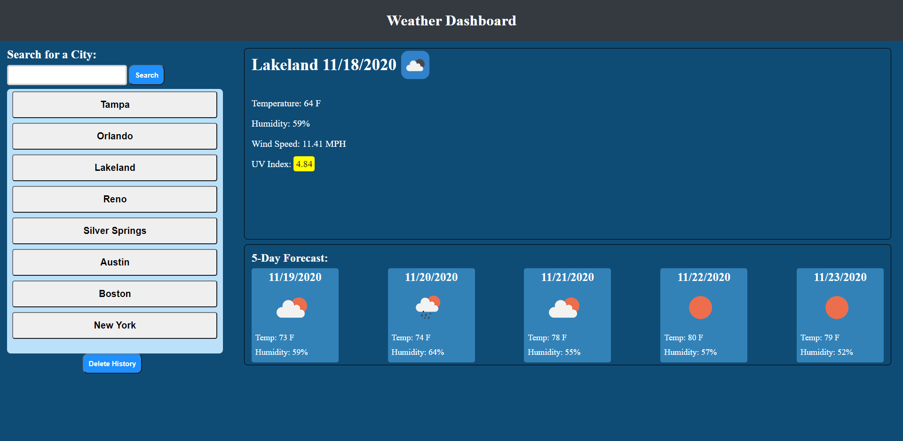

# Weather Dashboard

## Table of Contents:
* [Purpose](#purpose)
* [Features](#features)
* [Website](#website)

## Purpose
* This website will show you the current weather for a given city and will also a 5 day future forcast.

## Features
* Local Storage
* Open weather API and date.js
* Created with HTML, CSS, and JS

## Website

[Deployed Weather App](https://ajcuddeback.github.io/weather-dashboard)